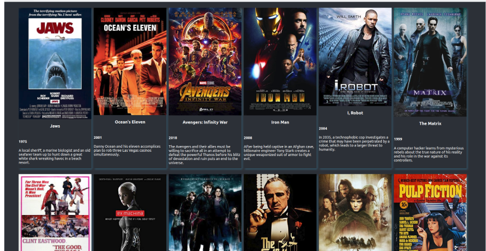



# Sprint 1 Movies

Dans les fichiers founies vous avez:
- un movie.json et un App.css.
- Vous devrez installer NodeJS, Vue js et NPM. 
- Dans la homepage , je veux que vous importiez le fichier movie.json et que vous affichiez tous le films grâce à v-for

## Resultat finale

